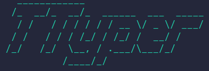
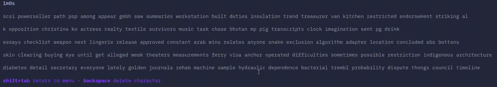
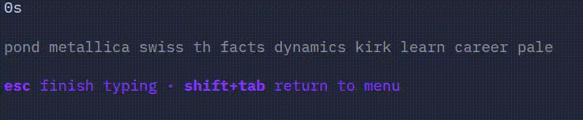
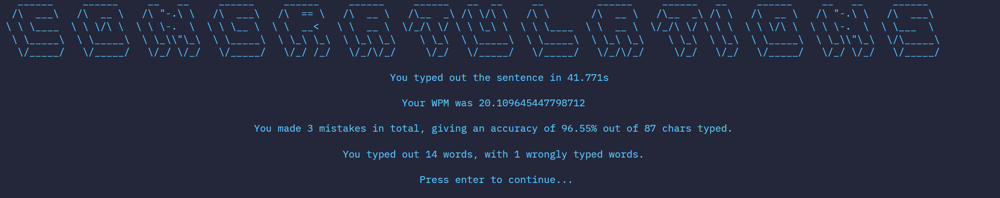
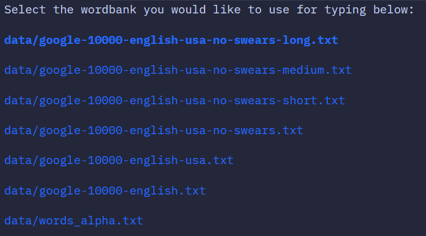

# TTyper, a CLI typing game built with the Go Bubbletea framework

Inspired by monkeytype, typeracer, etc, this is an command line typing game to test your typing speed.

It features 2 main modes:

## Time Attack
Type out as many words as you can within a minute!

## Endless
Relax and type out as many words as you like until you get bored!

# Features

## Results
After completion of each mode, you can view some stats on your typing performance:

## Wordbank selection
You can select from a variety of wordbanks:

## Acknowldegements

### Inspired by:

https://monkeytype.com/

https://play.typeracer.com/

### Wordbank repos

https://github.com/first20hours/google-10000-english/tree/master

https://github.com/dwyl/english-words/tree/master
